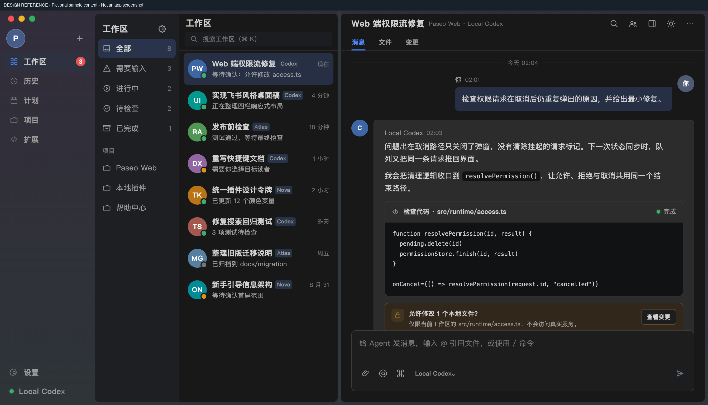
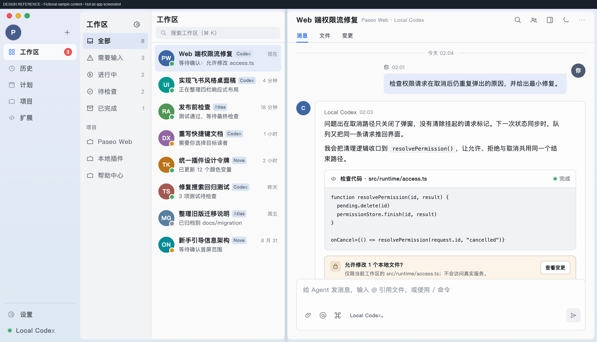

# Paseo Feishu UI

English | [简体中文](README.zh-CN.md)

Feishu-inspired light and dark themes for [Paseo](https://paseo.sh), with a desktop workspace layout, continuous assistant bubbles, compact tool cards, and first-line thinking previews.

An independent community project. It is not affiliated with Feishu/Lark, ByteDance, or the Paseo maintainers, and does not integrate with Feishu services.

## Install

Requires **Paseo 0.8.x on both the app and daemon**. The plugin manifest accepts `>=0.8.0 <0.9.0`; older and newer major API revisions are not supported.

```sh
paseo plugin install Laokashouji/paseo-feishu-ui --ref main
```

Select **飞书 · 浅色** (light) or **飞书 · 暗黑** (dark) in Settings → Appearance. Install on every daemon whose conversations should receive thinking previews; timeline contributions belong to the conversation's host.

```sh
paseo plugin update paseo-feishu-ui
paseo plugin disable paseo-feishu-ui
paseo plugin enable paseo-feishu-ui
paseo plugin remove paseo-feishu-ui
```

Git pushes do not automatically update installed copies. For local source development, run `paseo plugin reload paseo-feishu-ui` after changes; no daemon restart is needed.

## Features

- Light/dark palettes selected through native Appearance settings.
- Responsive desktop navigation, workspace groups, native workspace list, and a separated chat pane.
- A continuous visual bubble for adjacent thinking, tool, and assistant body rows, with one avatar gutter. Native rows retain their identity and virtualization.
- Command cards show the first command line. Thinking cards show the first nonempty line of text exposed by the provider, with expand/collapse and full-text copy.
- Read, Edit and Write cards show the native icon and path on one line, with ellipsis for long paths. The action name stays accessible to screen readers; missing paths keep the heading.
- Native tool details, file actions, permissions, attachments, composer and agent execution remain owned by Paseo.
- Exact theme gating and shared adapter cleanup across connected hosts.

## Platform support and limitations

| Client | Support |
| --- | --- |
| macOS desktop, Paseo 0.8.0 | Layout, bubbles, thinking/tool cards; exercised in the installed app |
| Browser | DOM adapter and compact layouts; Chrome fixture tests at 1342px and 390px |
| Official iOS / Android | **Theme colors only**; native bubbles, tools and thinking are unchanged |
| Windows / Linux desktop | Not tested |

The desktop adapter depends on version-specific Paseo DOM structure. It is not a public host styling API; verify it after a Paseo upgrade. The UI labels are currently Chinese.

Native mobile appearance requires additional upstream APIs: [compatibility details](docs/native-mobile-support.md), [upstream request #4697](https://github.com/getpaseo/paseo/issues/4697). The mobile HTML prototype in `design/` is a design reference, not an implemented iOS feature.

Thinking previews use only provider-exposed text; the plugin cannot make a provider disclose otherwise unavailable reasoning. Switching away from the Feishu theme restores native reasoning and resets that row's expansion state. Tool status is inferred from native visual state; idle calls show a neutral details hint because the DOM cannot reliably distinguish completed from canceled calls.

## Preview

These are **design references with fictional data**, not captures of a user's conversations. The implementation preserves native controls and differs in some details; the current thinking and command headings show first-line content.




[Interactive design](design/index.html) · [Thinking/tool design](design/thinking-tools/index.html)

## Data access

The plugin is client-only: no server entry, extra network connection, telemetry, credentials, model requests or workspace-file access. It reads Paseo's local appearance preference and rendered transcript structure to apply styles. The public reasoning transformer receives provider-exposed thought text; copy buttons write that text to the clipboard only when clicked. Dependencies are public npm packages, and `package-lock.json` uses `registry.npmjs.org` exclusively.

Paseo plugins execute trusted code inside the app. Inspect [the adapter contract](docs/desktop-adapter.md) and [the publication audit](docs/publication-audit.md) for the exact boundaries.

## Development

Node.js 20.19.4+ and npm:

```sh
npm ci --registry=https://registry.npmjs.org
npm run typecheck
npm test
npm run test:browser
```

Browser tests require an installed Chrome; set `CHROME_PATH=/path/to/chrome` outside the default macOS path. Tests use fictional RNW-shaped content and do not count as iPhone verification. See [verification](docs/verification.md) for native checks and coverage limits. The historical `message-grouping.browser.js` check is superseded by `response-bubble.browser.js` for shared bubbles.

`index.client.tsx` registers themes and settings. `client/web.ts` isolates browser integration and lifecycle cleanup. `client/thinking.tsx` renders exposed reasoning only while the web adapter's exact theme gate is active. Native iOS/Android exit before browser integration or reasoning replacement.

## License

[MIT](LICENSE). Product names belong to their respective owners.
