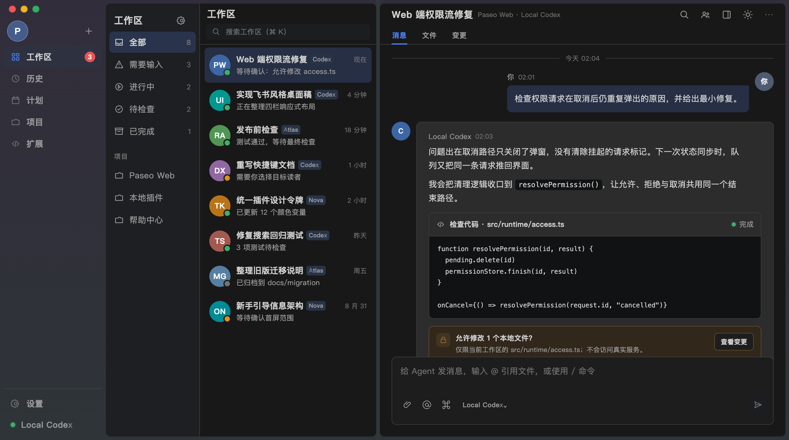

# Paseo 飞书外观

[English](README.md) | 简体中文

独立社区项目，仅参考飞书的视觉风格，不接入飞书服务，与飞书、字节跳动或 Paseo 官方无隶属关系。

为 Paseo 提供飞书式浅色、暗黑主题与桌面四栏布局：应用导航、工作区分组、会话列表和原生聊天区域。支持真实工作区切换、搜索、分组、工具调用和原生输入框。



[查看浅色设计稿](design/desktop.png)

读取、编辑、写入文件采用“原生图标＋路径”单行展示；长路径单行省略，没有路径时保留操作标题。读屏操作名称、完整路径文本和原生展开、打开文件行为保留。此布局适用于桌面／网页，官方 iOS／Android 仍仅支持主题配色。

Claude Code 的 Explore 卡片采用“搜索图标＋任务描述”单行展示，不再单独显示 Explore 标题；没有描述时保留标题。图标与文字居中，原生详情、展开和状态提示继续保留。

## 安装

适配 Paseo **0.8.x / 0.9.x**，已核对 0.8.0 和 0.9.1。App 和 daemon 均需处于支持范围；暂不声明支持 0.7 或 0.10 及以上版本。使用 Node.js 20.19.4 或更高版本。

```sh
paseo plugin install Laokashouji/paseo-feishu-ui --ref main
```

在每台会话所属主机上安装。后续通过 `paseo plugin update paseo-feishu-ui` 更新；GitHub 推送不会自动更新已安装副本。

在 **设置 → 外观 → 主题** 中选择 **飞书 · 浅色** 或 **飞书 · 暗黑**。两者都是 Paseo 原生主题，选择后保存到当前客户端。在 **设置 → 主机 → 插件 → paseo-feishu-ui → 飞书外观** 可打开使用说明，也支持 `⌘K` 搜索“飞书外观设置”。插件 ID 保持为 `paseo-feishu-ui`；自定义安装 ID 需要同步修改适配器的精确主题 ID。

插件需在目标 daemon 启用插件功能。Paseo 插件运行受信任的本地代码；本插件使用纯客户端入口，不启动服务端子进程，不读写工作区文件、不调用 Agent、不建立额外连接。

## 布局与操作

- 1180px 及以上：180px 导航、160px 分组、300px 工作区列表与 6px 间隔，聊天区域自适应。列表与聊天保留独立的 8px 圆角面板。
- 950–1179px：收起分组栏，保留 160px 导航、300px 列表与 6px 间隔。
- 760–949px：104px 图标导航、254px 列表与 6px 间隔；导航宽度为 macOS 窗口按钮留出空间。
- 760px 以下：保留 Paseo 原生紧凑菜单与聊天布局。切到窄窗口时自动恢复全部分组。
- 分组栏筛选原生状态分组；项目分组模式下使用原生项目列表。搜索和显示偏好打开 Paseo 原生菜单。
- 桌面栏宽随窗口区间固定，隐藏原生侧栏拖拽柄。关闭侧栏、切换主题或停用插件可恢复原生布局与侧栏宽度。

同一条助手回复的多段内容连成一张卡片；原生分段和虚拟滚动继续由 Paseo 管理。桌面消息与输入区域最大宽度为 1000px，输入框最小高度为 116px。

思考、工具与正文按原生顺序连接为一张连续的助手气泡，统一避开头像留白。命令卡片只显示第一行命令；思考卡片显示模型已提供的第一行思考内容。运行中为蓝色，工具失败为红色，同时适配浅色与暗黑主题。展开后可复制完整详情，长命令在详情内部横向滚动；原生文件操作与权限确认继续保留。静止工具条目显示“详情”，不把取消误标为成功。窄屏工具仍按 Paseo 的原生行为打开详情面板；思考在原位展开。

思考预览使用 Paseo 0.8–0.9 的公开渲染接口，需要在会话所属主机也安装同版插件。它仅在桌面/网页选中飞书主题时注册，其他主题恢复原生思考条目；正文、工具、权限和附件没有被替换。

输入框、快捷键、草稿、附件、权限确认和代码交互由 Paseo 管理。**iOS/Android 当前仅支持配色**，聊天气泡、思考与工具卡片、消息间距、输入框和导航尚未换肤。已核对的官方 0.8.0 / 0.9.1 没有原生消息样式接口；直接替换消息会丢失附件和回退等原生行为，故本插件保留原生消息。升级 Paseo 不会自动获得手机气泡。参见[原生适配所缺接口](docs/native-mobile-support.md)和[已提交的上游需求 #4697](https://github.com/getpaseo/paseo/issues/4697)。

## 开发与停用

```sh
npm run typecheck
paseo plugin reload paseo-feishu-ui
paseo plugin logs paseo-feishu-ui
paseo plugin disable paseo-feishu-ui
# 恢复
paseo plugin enable paseo-feishu-ui
# 卸载配置，保留本地源代码
paseo plugin remove paseo-feishu-ui
```

无需重启 daemon。切换其他主题同样会移除布局样式。客户端适配器在最后一个实例断开时清理样式、DOM 标记、辅助导航、观察器和定时器。

## 设计与验证

设计稿由 OpenDesign / Local Codex 生成。第二版在 1342×750 下与真实飞书暗黑窗口对照，补齐独立面板、6px 间隔和双主题；随后在安装的 Paseo 中验证实际界面。仓库中的设计稿全部使用虚构内容；真实截图与调试工具不进入 Git。

- [思考与工具调用设计稿](design/thinking-tools/index.html)及[设计评审](design/thinking-tools/REVIEW.md)
- [设计对照](design/COMPARISON.md)与[交互设计稿](design/index.html)
- [插件实现调研](docs/paseo-plugin-research.md)与[适配器约束](docs/desktop-adapter.md)
- [本机验证记录及未覆盖项](docs/verification.md)

`index.client.tsx` 注册主题、说明页和设置页；`client/settings.tsx` 使用 React Native 组件；`client/web.ts` 集中管理 Web DOM、样式和清理。TypeScript 不加载 DOM 库，原生入口在访问浏览器 API 前退出。`client/thinking.tsx` 提供受桌面主题开关控制的思考预览。桌面布局依赖 Paseo 的语义属性，每次版本升级都需重新验证。

`npm test` 检查 iOS/Android 在没有浏览器全局变量时能加载入口及两套主题；这不是原生实机渲染测试。浏览器回归脚本见 `tests/`。

`npm run test:browser` 在已安装的 Chrome 中加载实际适配器，检查工具卡片的展开、复制、状态变化、消息连续性、主题隔离及多实例清理。默认使用 macOS Chrome 路径，其他环境设置 `CHROME_PATH=/path/to/chrome`。测试使用虚构的 RNW 结构，不是 iPhone 实机测试。
